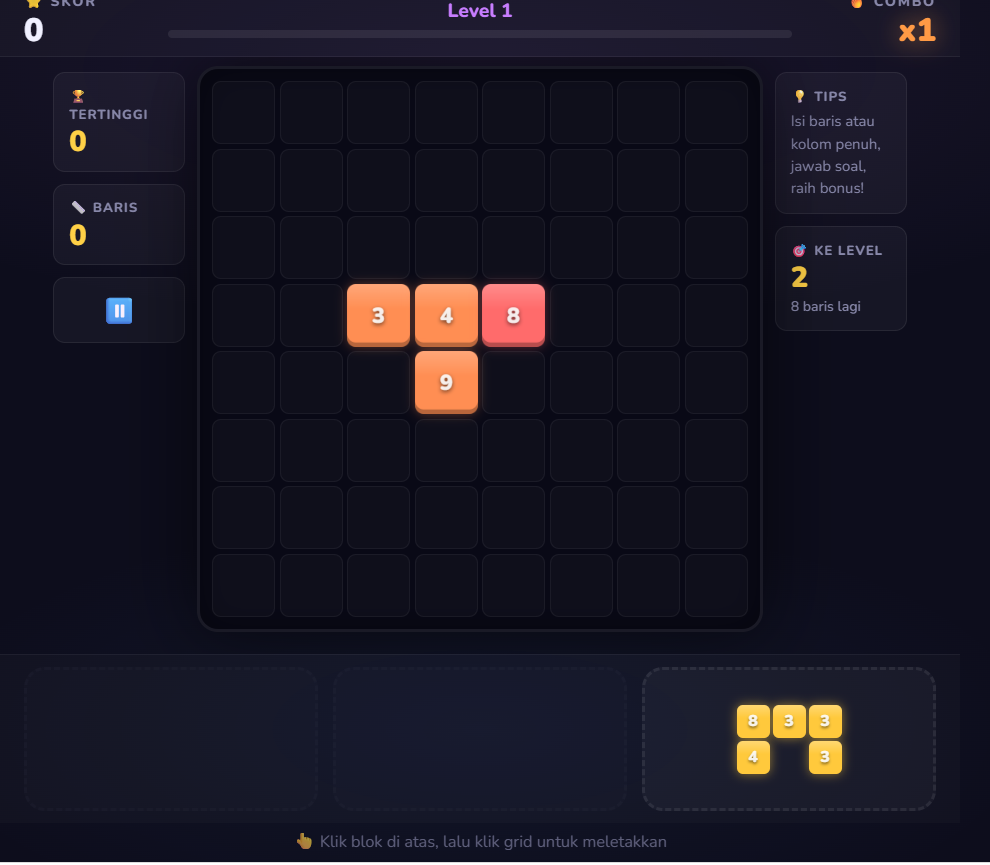

# Math Block Blast 🧩🔢

Game puzzle blok matematika interaktif yang menggabungkan mekanisme puzzle susun blok klasik (*Block Blast*) dengan operasi aritmatika cepat untuk melatih kecepatan berhitung dan ketajaman logika!

---

## 📸 Preview Gameplay

---

## 🎮 Fitur Utama
- **Mekanisme Puzzle Blok Interaktif**: Tempatkan balok angka ke grid untuk membentuk garis penuh vertikal/horizontal atau menyelesaikan target persamaan matematika.
- **Tantangan Aritmatika**: Menghitung cepat operasi penjumlahan, pengurangan, dan perkalian.
- **Audio & Visual HD**: Desain antarmuka modern, partikel animasi ledakan blok (*blast*), dan efek suara responsif.
- **Multi-Platform**: Responsif pada layar desktop maupun perangkat mobile/layar sentuh.

---

## 🚀 Cara Menjalankan
Buka file `index.html` langsung di browser pilihan Anda atau jalankan melalui web server statis lokal.
